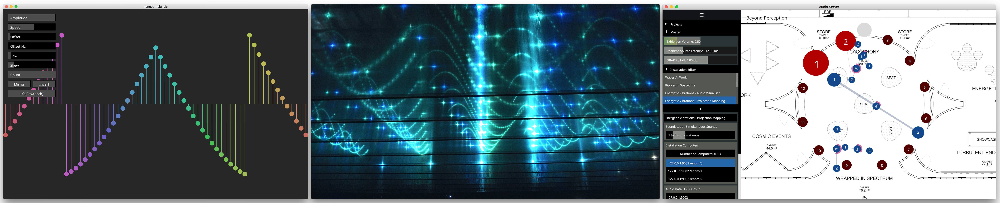
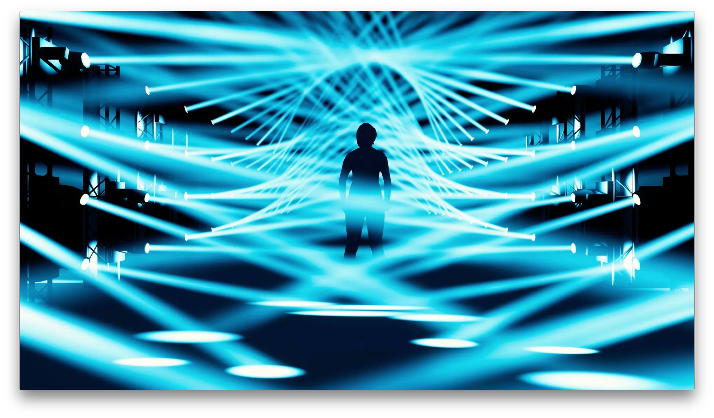
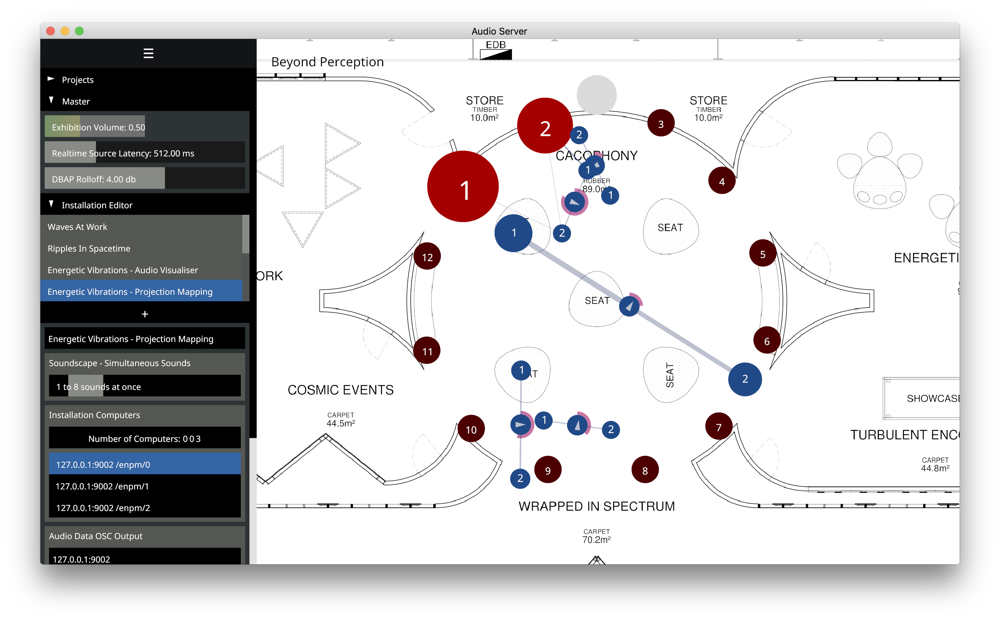

Welcome to the initial release of Nannou!

Nannou is an open source creative coding framework built in Rust for artists, hackers, designers and devs to express themselves with simple, fast, reliable, portable code.

If you would prefer to jump straight in you can [get started here](https://github.com/nannou-org/nannou#getting-started)!

*Simple Harmonic Motion GUI, [LATTICE](https://www.mindbuffer.net/lattice/) laser installation, [Spatial Audio Server](https://github.com/museumsvictoria/spatial_audio_server).*

Whether working on a 12-month laser installation or a 5 minute sketch, Nannou aims to give artists easy access to the tools they need.

## Motivation

Nannou is founded on three foundational motivations:

1. **A fast, modern language.** When experimenting with the cutting edge in audiovisual processing high performance becomes a necessity. When performing live or creating long-running installations reliability becomes equally important. Rust ticks these boxes and more. Read more about why we chose Rust [here](https://github.com/nannou-org/nannou#why-rust).
2. **Batteries Included.** One of the beauties of being a creative coder is that we have the potential to create works in a wide range of domains. Nannou aims to give equal priority to a full suite of creative I/O including graphics, multi-windowing, audio, lasers, lighting and more. See a more detailed list of both planned and existing features and protocols [here](https://github.com/nannou-org/nannou#goals).
3. **Open Source & Liberally Licensed.** Access to these technologies is often expensive and locked behind proprietary systems. We believe in democratising this space by open sourcing Nannou for everyone to use.

## Join Us!

Although we have been working hard over the last year, Nannou is still a young project and there is a lot of [work to be done](https://github.com/nannou-org/nannou#goals). We envisage Nannou as a community project - a collaborative effort at building an artistic foundation on which we can all go forth, create and realise our own crazy and unique ideas.

We invite you to play by [exploring the included examples](https://github.com/nannou-org/nannou#nannou-examples) or perhaps by having a go at porting an existing Processing / openFrameworks / Cinder sketch. If you are interested in contributing, whether it be code, ideas or feedback we would love to hear from you! Feel free to open pull requests and leave issues at the [GitHub repo](https://github.com/nannou-org/nannou), post in the [forum](http://forum.nannou.cc) or chat with us on [our slack channel](https://nannou.slack.com).

We are extremely excited Nannou's potential and we look forward to building an inclusive, thriving community together with you all.

## Upcoming Workshops

We are currently in **Barcelona** and have several events planned for the coming weeks:

1. A creative coding meetup at [Protopixels studio](https://protopixel.net/) on the 26th of June.
2. The [Makers of Barcelona](http://www.mob-barcelona.com/) space (date TBA).
3. A workshop with the [Telenoika](http://www.telenoika.net/) creative collective (date TBA).

We are also going to be at Sonar Festival this week. [Get in touch](contact@nannou.cc) if you would like to meet up!

If you are interested in hosting a Nannou workshop or presentation please get in touch! Even if we can not be there in person, we can provide materials that may help you to host your own.

## Thanks for Reading!

[Get started here](https://github.com/nannou-org/nannou/tree/readme#getting-started).

We'll leave you with some of recent works that we have created using Nannou.

- [**LATTICE**](https://www.mindbuffer.net/lattice/) - a 5x channel audiovisual laser installation driven by custom generative music software.

- [**ORACLE**](https://www.mindbuffer.net/oracle/) - an immerse installation featuring 128x moving-heads and spatial audio.

  

- [**Spatial Audio Server**](https://github.com/museumsvictoria/spatial_audio_server) - a cross-platform, n-channel spatial audio server developed for Scienceworks & Museums Victoria.

  

*With love and lazers from Mitch, Josh, Keenan & Tom | The Nannou Organisation <3*
