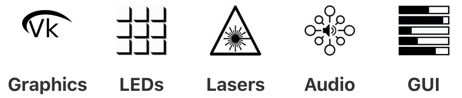
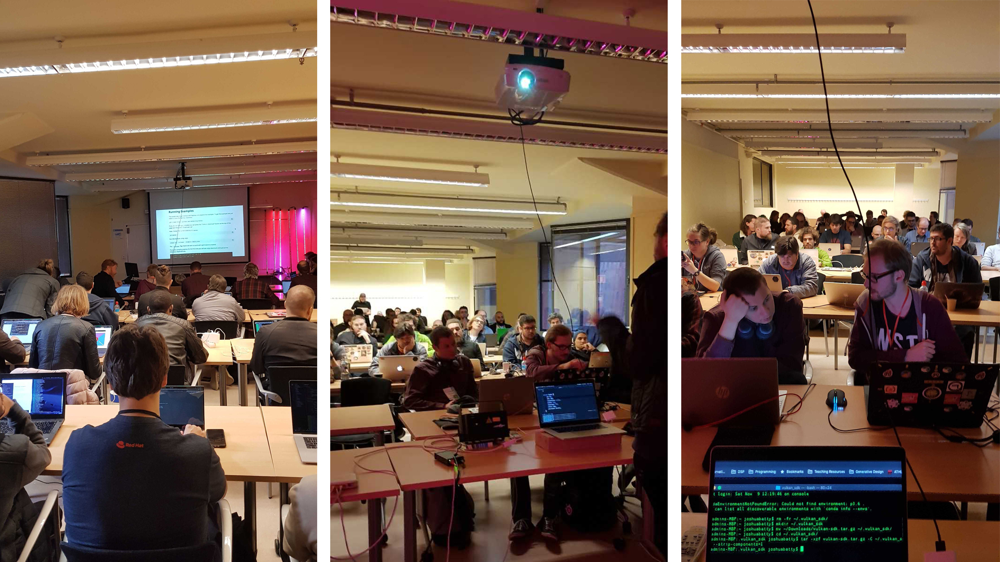
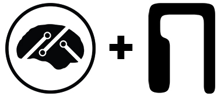

 

# Creative Coding with Nannou

## Overview

Creative coding is a way of looking at programming as a tool for creative expression. One of the beauties of creative coding is the potential to express ourselves in a wide variety of domains. 
**Nannou** is a modern creative coding framework that aims to give equal priority and easy access to a full suite of creative input and output including graphics, audio, LASERs, lighting and more.

We would like to propose a two hour workshop where attendees get an introduction to creative coding through **nannou** along with the opportunity to use **nannou** to experiment with each of these domains in a guided, relaxed and playful setting.

 

## Workshop Description

A two-hour interactive workshop introducing **nannou** as a tool for creative coding.
The workshop will begin with a short 20 minute presentation introducing ourselves, **nannou** and the underlying motivations that drive the project and community.
Following the presentation, we will dive into a hands-on walk-through of some featured examples that demonstrate **nannou**'s diverse potential. These will begin by covering windowing, graphics, GUI and audio. Users are encouraged to run the examples on their own machine and modify them in creative ways to change their output.
 

<iframe src="https://player.vimeo.com/video/396401338?autoplay=1&loop=1&autopause=0?muted=1&background=1" width="640" height="214" frameborder="0" allow="autoplay; fullscreen" allowfullscreen></iframe>

 

Finally, we will take a look at a small, pre-setup collaborative installation featuring some DMX addressable LED bars and a single LASER projector (provided by us). Attendees will have the opportunity to connect to a WLAN and send some pre-prepared controls via **nannou**'s OSC API. If time permits, attendees will be given time to freely experiment with the knowledge they've been bestowed with access to myself and Josh for assistance. The workshop will end with some concluding remarks, an opportunity for feedback, discussion around the **nannou** community, how to get involved, and thanks for attendance!

 

### Intended Audience

We welcome artists who are new to creative coding, existing coders looking to get in touch with their creative side, and everyone in between. Attendees who have some beginner experience with coding in any language may find the workshop easier, but this is not a strict requirement.

### Ideal Outcomes
* Attendees feel inspired by the realisation of their ability to express themselves creatively through code using **nannou**.
* Artists are excited by the potential to express themselves through multiple mediums.
* Beginner coders see **nannou** as an exciting, interactive way to experiment and learn coding.
* Creative coders coming from frameworks in other languages such as Processing and OpenFrameworks understand the benefits of using Rust.
* Creative coders interested in Rust find a welcoming community of like-minds that share their vision and will value their contributions.

### Pre-requisites
Users should come prepared with a charged laptop running either macOS, Windows or Linux and have **nannou** built on their system as [per the guide](https://guide.nannou.cc/getting_started.html).

## Workshop Timeline

1. Short introduction of ourselves, creative coding, **nannou** and its motivations. 
2. A guided walk-through of some provided examples:
   * 2D graphics with **nannou**'s Draw API.
   * Simple graphical user interface.
   * Using multiple windows.
   * Simple audio synthesis and file playback.
   * Networked interaction via OSC.
3. LASER and LED lighting control demonstration.
4. Free experimentation if time permits.
5. Concluding remarks
    * Joining the community on slack
    * Visiting the online guide
    * Contributing
    * Thanks!

## About MindBuffer 

The workshop will be hosted by Joshua Batty and Mitchell Nordine, experienced creative coders and two of the three **Nannou** Organisation co-founders. The duo have given **nannou** workshops around the world including as a part of the Creative Coding meetup in Berlin, Media Lab in Melbourne and at the RustFest 2019 Conference in Barcelona where over 50 participants took place in a two-part, four hour booked-out workshop.
 

<i>**nannou** Creative Coding Workshop by MindBuffer - RustFest BCN 2019</i>

Joshua Batty has a PhD in audiovisual relationships and has experience in teaching creative coding in an educational, university setting. Mitchell Nordine is a long-time member of the open source creative coding community, most notably founding the RustAudio organisation, the Conrod GUI library and now the Nannou Organisation.

Joshua and Mitchell make their living through creative coding as <a href="https://mindbuffer.net" target="_blank">MindBuffer</a>, an award-winning audiovisual research and digital design studio, specialising in immersive interactive art installations with notable clients including Museums Victoria, RMIT University, IBM Watson and Studio Robert Henke.

**Nannou** is the foundation of all of their recent work, both personal and commercial. The majority of their spare time is spent contributing to the framework and assisting the growing community.
